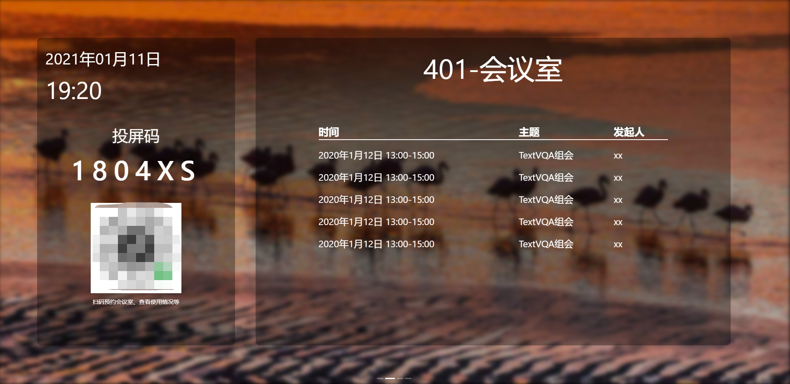

<div align= "center">

<h2 align="center" style="">EasyMeeting</h2>
<h3 align="center" style="">TV</h3>
<br/><br/>
</div>


## About Easymeeting

“会易”是一款专为会议室打造的智能会议解决方案。
“会易”支持会议室创建与管理、会议室预约、会议预约、签到、迟到抢占、无线投屏等多种功能。有自己的用户体系，并支持微信小程序绑定和扫码登陆。

Easymeeting is an meeting solution specially built for conference rooms.
Easymeeting supports various functions such as conference room creation and management, conference room reservation, meeting reservation, check-in, room preemption, wireless screen casting, etc. Has its own user system, and support wechat miniprogram binding and wechat scan login.

## About This Project
本工程是投屏端部分代码。
This project is part of the TV code.

若要使用，请：
- 修改src/renderer/config.json为你的服务器地址

To use, please:
- Modify src/renderer/config.json to your server address

在实际使用中，投影屏幕需要连接到一个计算机，该计算机需要联网并运行本程序。该屏幕控制计算机可以是嵌入式Linux（如树莓派），也可以是个人电脑（如PC）
For real use, the projection screen needs to be connected to a computer that needs to be networked and run this program. The screen control computer can be an embedded Linux (such as raspberry PI) or a personal computer (such as A Windows PC)

支持功能 Support functions: 
- [x]  小程序扫码绑定 Miniprogram scan code login
- [x]  扫码远程控制  Remote Control
- [x]  WebRTC无线投屏 Wireless screen casting
- [x]  多系统支持（Mac、Win、Linux）Multi-system support
- [x]  会议室信息展示 Conference room schedule display
- [x]  会议签到（配合小程序实现）Meeting check-in (with miniprogram implementation)
- [x]  会议室抢占（配合小程序实现）Meeting room preemption (with miniprogram implementation)
- [x]  投屏码展示 Screen cast code display
- [ ]  设置 Settings

## ScreenShots
设备启动初始化页面 Init Page


主页 Index



实际使用展示 Actual use


## Develop


欢迎提pr或更好的idea！

Welcome to submit PR or better idea!

``` bash
# install dependencies
yarn install

# serve with hot reload at localhost:9080
yarn run dev

# build electron application for production
yarn run build

#build linux appImage
yarn run build:linux
```

---

This project was generated with [electron-vue](https://github.com/SimulatedGREG/electron-vue) using [vue-cli](https://github.com/vuejs/vue-cli). Documentation about the original structure can be found [here](https://simulatedgreg.gitbooks.io/electron-vue/content/index.html).
